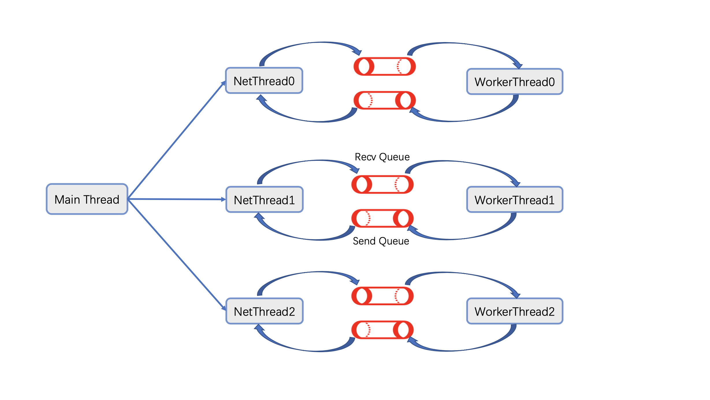

# 🌟 Unixtar

### `✨Unique Star✨`

[中文版传送门](README_zh.md)

The framework is a Web-Server on unix based system.

Without using any third-party libraries, the framework writes from unix system calls and standard C library functions.

The framework adopts the model of `Epoll + NetThreads + WorkerThreads`:



The framework focuses on the following tasks:
* The transport and IP layers use UNIX domain socket directly, with each network thread working with an Epoll object and multiple worker threads to provide concurrency.
* Http server. Responsible for short connection requests. Framework completes Http protocol Serialization and Parsing. The Http body can be serialized by `Protobuf`. Framework Provides overload protection capability.
* WebSocket server. Responsible for long connection requests, providing the ability to actively push messages to self or/and other connections. Framework completes WebSocket protocol handshake, Packing, Parsing, wave.
* Reverse proxy. Provides the ability to forward requests to service nodes and load balancing. You can choose among several load balancing strategies.
* Coroutine. Coroutine context switching implemented by AT&T assembly (implementation in progress).
* The code of the transport layer module is completely independent of the specific application layer protocol, you can easily add your own application layer protocols by inheriting the `ApplicationPacket` class.
* You can easily add network interfaces by inheriting the `NetSceneBase` class.
* You can use the built-in thread pool singleton to complete your own asynchronous tasks, which can be: immediate, immediate with serialized tag, periodic, or delayed task.

Workflow when processing HTTP short link requests:


## ✨ Build (unix)
```shell
$ git clone --recursive https://github.com/xingyuuchen/unixtar.git framework
$ cd framework/script
$ bash autogen.sh   # do this if you want to use ProtoBuf.
$ bash cmake.sh -d   # -d: build will run as a daemon process, logs redirected to file using linux rsyslog, instead of stdout.
```

## ✨ Example Usage
### Http short-link
You are only responsible to write `NetScene` to get your business logic done.

Each network interface is represented by a class(`NetScene_xxx`). They all inherit indirectly from `NetSceneBase`. You can treat it as a `Servlet` in Java.

If you use `ProtoBuf` to serialize your data, inherit from `NetSceneProtoBuf` and use the POST request.

Else, to customize your network communication protocol, inherit from `NetSceneCustom`. GET and POST are supported.

After defining your network interface classes and implement your business logic, please register your class to the framework: `NetSceneDispatcher::Instance()::RegisterNetScene<NetScene_YourBusiness>();`.

You can custom some configuration by editing `webserverconf.yml`. You can custom:
* Port on which the process is listening.
* Number of threads handling network events.
* Number of threads handling business logic.
* Maximum number of connections.
* Maximum business backlog (exceeding this threshold is considered overloaded).
* Reverse proxy server information, the period during which heartbeat packets are sent.

After configuration, call `WebServer::Instance().Serve();`, and the service just gets started!

Hope you enjoy :)

```c++
#include "log.h"
#include "webserver.h"
#include "netscenedispatcher.h"
#ifdef DAEMON
#include "daemon.h"
#endif

int main(int ac, char **argv) {
#ifdef DAEMON
    if (unixtar::Daemonize() < 0) {
        printf("daemonize failed\n");
        return 0;
    }
#endif
    
    logger::OpenLog(argv[0]);

    WebServer::Instance().Config();
    
    LogI("Launching Server...")
    
    // NetScene_YourBusiness must inherit from NetSceneBase, which is your
    // predefined network interface (e.g. A specific Http url route)
    // See class NetSceneGetIndexPage below for detail.
    NetSceneDispatcher::Instance().RegisterNetScene<NetScene_YourBusiness>();
    NetSceneDispatcher::Instance().RegisterNetScene<NetScene_YourBusiness1>();
    NetSceneDispatcher::Instance().RegisterNetScene<NetScene_YourBusiness2>();
    
    WebServer::Instance().Serve();
    
    LogI("Webserver Down")
    return 0;
}
```

#### Here is an example of a network interface class:
```c++
#pragma once
#include "netscenecustom.h"
#include <mutex>

class NetSceneGetIndexPage : public NetSceneCustom {
  public:
    NetSceneGetIndexPage();

    // The unique NetScene type.
    int GetType() override;

    // New instance of your NetScene here.
    NetSceneBase *NewInstance() override;

    // Your business logic here.
    int DoSceneImpl(const std::string &_in_buffer) override;
    
    // Http body pointer.
    void *Data() override;

    // How long your http body is.
    size_t Length() override;

    // Http url route.
    const char *Route() override;

    // Http Content-Type.
    const char *ContentType() override;

  private:
    char                        resp_[128] {0, };
    static const char *const    kUrlRoute;
    static const char *const    kRespFormat;
    static std::mutex           mutex_;
    
};
```
```c++
#include "netscene_getindexpage.h"
#include "constantsprotocol.h"
#include "log.h"
#include "http/headerfield.h"

const char *const NetSceneGetIndexPage::kUrlRoute = "/";

const char *const NetSceneGetIndexPage::kRespFormat =
        "If you see this, the server is running normally, %d visits since last boot.";

std::mutex NetSceneGetIndexPage::mutex_;

NetSceneGetIndexPage::NetSceneGetIndexPage() : NetSceneCustom() {}

int NetSceneGetIndexPage::GetType() { return 0; }

NetSceneBase *NetSceneGetIndexPage::NewInstance() { return new NetSceneGetIndexPage(); }

int NetSceneGetIndexPage::DoSceneImpl(const std::string &_in_buffer) {
    static int visit_times_since_last_boot_ = 0;
    std::unique_lock<std::mutex> lock(mutex_);
    // count up visitors.
    snprintf(resp_, sizeof(resp_), kRespFormat, ++visit_times_since_last_boot_);
    return 0;
}

const char *NetSceneGetIndexPage::ContentType() { return http::HeaderField::kTextPlain; }

void *NetSceneGetIndexPage::Data() { return resp_; }

size_t NetSceneGetIndexPage::Length() { return strlen(resp_); }

const char *NetSceneGetIndexPage::Route() { return kUrlRoute; }
```
Note: It is highly recommended to use `ProtoBuf`. Some predefined protobuf .proto files is in `/protos/`, you can run:
```shell
$ cd framework/script
$ bash autogen.sh
```
to generate protobuf c++ files, see `NetSceneHelloSvr.cc` for instance.

### WebSocket long-link
Although Http protocol can maintain long links, it does not provide the server with the ability to actively push messages to the client. Use `WebSocket` to fill this gap.


## ✨ Example Project
[Plant-Recognition-Server](https://github.com/xingyuuchen/object-identify-SVR.git) is a web-server project, under the hood it is `unixtar` provides basic http network capability.


## ✨ Reverse Proxy
You can launch a reverse proxy by commands below:
```shell
$ cd framework/script
$ bash launchproxy.sh
```

Reverse proxy do such things:
* Forward. Forward Http packet to web servers who truly handles request, then pass back Http response.
* Load Balance. You can chose among three different rules: `Poll`, `By weight`, `IP Hash`.
* Registry Center. Receive heartbeats from all web server nodes and maintain states for them. 

Configure your reverse proxy by editing `reverseproxy/proxyserverconf.yml`. You can custom:
* Port that reverse proxy server listens on.
* Load balancing strategy.
* All web server nodes available to forward Http request.
* Maximum connections at the same time.
* Number of threads who handles network events.


## ✨ License
If you use this software for your research, a footnote with the link to this repository is appreciated: `github.com/xingyuuchen/unixtar.git`.

Or for citation with `BibTeX`:
```
@misc{2021unixtar,
  title={unixtar: A Http/WebSocket Server Framework on Linux.},
  author={Xingyu Chen},
  howpublished={\url{https://github.com/xingyuuchen/unixtar.git}},
  year={2021}
}
```

